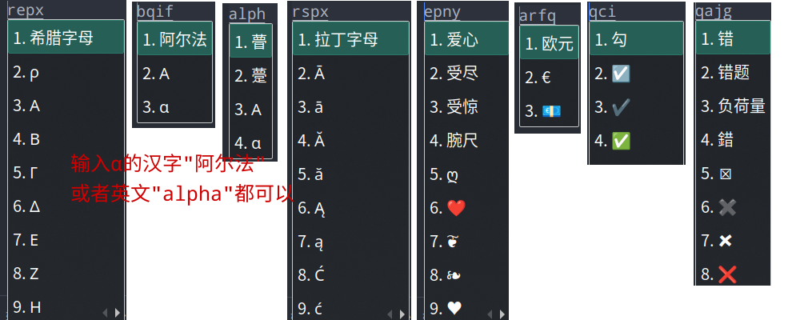

## 这是什么

虽然在Fcitx5中可以使用 `Ctrl+Shift+Alt+U` 来调出Unicode特殊字符输入，但对多数人来说，这仍然不太方便，因此有了本项目。

本项目利用 [参考](#参考) 一节列出的三个网址提供的信息，把常见的包括Emoji在内的特殊符号和词组关联起来，然后将词组转换为五笔编码，同时将其对应的特殊符号也转换为对应的五笔编码，实现简单快捷高效的用五笔打出特殊符号。

## 示例

比如在 [symbold/emoji.tsv](symbold/emoji.tsv) 中定义了这样一行数据：

```tsv
U+1F923	🤣	笑得满地打滚 笑脸 打滚 地板 大笑 打滚儿 笑出眼泪 笑哭 笑哭了 笑得打滚 笑得打滚儿 笑得满地打滚儿
```

那么我们可能以五笔词组的方式打出上述任意一个词组，都将可以看到 `🤣` 这个Emoji符号，比如在五笔98版中：


旗帜及其他的表情也可以：


当然，除了Emoji，其实还有大量的符号，比如我们想要直接打出乘号、除号及一些其他特殊符号等等，仍然以五笔98版举例：





## 注意事项

1. 自动生成的五笔码是按照五笔规则的最长最完整的键码，如果有些符号对应的词组的五笔码不足4码，你如果想打出来，需要尽可能的按照五笔组字规则打到最长最完整。有时候需要打到补码为止；有的要按照五笔规则补到4位，比如 `一` 的完整五笔码为 `ggll`，完整打出 `ggll` 才会显示和 `一` 相关联的特殊字符。
2. 部分特殊符号还与英文相关联了，这时只要打出英文即可（超过4位的只打前4位，只有1个键将其重复到4个键，只有2个键的也需要再重复一次到共4个键，如果原本就有三个字母的则不作调整），详细的你可以浏览 [symbols](symbols) 下面的每个文件。
3. **如果上一条规则中关联的英文中含有字母 `z`，则用 `x` 代替，比如示例图中的 `㎑` 关联的是 `khx`。**

## 如何使用

> **以Fcitx5为例。**

### 1. 下载特殊符号库

下载 [output](output) 下面的文件，或者直接从 [release](release) 中下载后解压，对应关系如下：

- `wb86.txt`: 对应五笔86版
- `wb98.txt`: 对应五笔98版
- `wbnewage.txt`: 对应五笔新世纪版

> 注：上述三个文件都是编码在前，词组在后。如果你所使用的输入方案需要词组在前，编码在后，比如RIME，则需要调整一下上述三个文件。以 `wb98.txt` 为例，你可以运行以下命令来调整：

```shell
awk '{print $2 "\t" $1}' wb98.txt > wb98_new.txt  # 以制表符分隔，如果要以空格分隔，则将命令中的 \t 调整为一个空格
```

### 2. 备份原有自造词

备份原有自造词（不同五笔版本的用户词库有不同的名字）：

```shell
libime_tabledict -d -u ~/.local/share/fcitx5/table/<你的词库名>.user.dict ime-dump.txt
```

### 3. 合并词库

针对之前有导入过个人词库的情况：如果你要保留Fcitx5自动造的词，那么则将从本仓库下载的词库内容粘贴到 `ime-dump.txt` 中 `[Auto]` 这一行之前；如果不保留Fcitx5自动造的词，那么就将 `ime-dump.txt` 中 `[Auto]` 之后的内容删除后，将从本仓库下载的词库内容粘贴到 `ime-dump.txt` 后面。

### 4. 导入词库

**退出Fcitx5**，然后将合并后的词库导入用户词库：

```shell
libime_tabledict -u ime-dump.txt ~/.local/share/fcitx5/table/<你的词库名>.user.dict
```

然后再重启Fcitx5即可使用。

## 自己生成

如果觉得特殊符号太多了，可以自己自己将 [symbols](symbols) 下面的文件按照 [如何贡献](#如何贡献) 中列出的数据规则调整后，自己生成，在仓库中运行以下脚本即可：

> *需要安装 [imewlconverter](https://github.com/studyzy/imewlconverter) 和 `dos2unix`。*

```shell
./convert.sh
```

## 如何贡献

本仓库内容并不包含全部的特殊字符，如果你希望添加，可以向本仓库PR，提交到 [symbols](symbols) 文件夹即可。数据规则：

- 每个 `tsv` 文件分为3列，每列间以制表符分隔；
- 第1列为该特殊字符的Unicode编码，此列在生成五笔编码时并不起作用，只是为了区分相近的符号用的；
- 第2列为该特殊字符本身；
- 第3列为要与该字符关联的词组，多个词组之间使用半角空格分开，如果想直接与英文字母相关联，则直接输入英文字母，限定3位或4位，过少的重复字母到4位，如出现 `z` 则用 `x` 代替。

## 参考

- [emojiall](https://www.emojiall.com)
- [fcitx5-chinese-addons](https://github.com/fcitx/fcitx5-chinese-addons/blob/master/im/pinyin/symbols)
- [symbl](https://symbl.cc/cn/)
